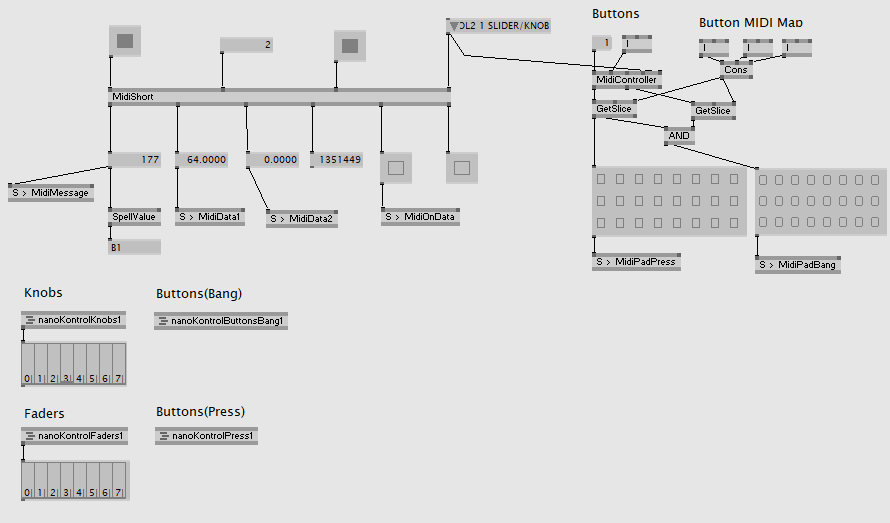

# VVVVnanoKontrolManager
KORG nanoKONTROL2 manager for VVVV

## 概要
KORGのnanoKONTROL2をVVVVで自分なりに使いやすくしたパッチです。  
つまみとフェーダーとフェーダー横のボタンの押下状態が取れるようになっています。  
デフォルトでチャンネル１の設定になっているので、で書き換えるか、nanoKontrokManagerパッチの左上のButtonsのChannelを書き換えてください。  

入力はすべてSノードで送られるので、適宜Rノードで受け取って使ってください。  

- つまみ：MidiKnob(1～8)  
- フェーダー：MidiFader(1～8)
- Sボタン押下状態：MidiPadPress(1～8)S
- Mボタン押下状態：MidiPadPress(1～8)M
- Rボタン押下状態：MidiPadPress(1～8)R
- SボタンBang：MidiPadBang(1～8)S
- MボタンBang：MidiPadBang(1～8)M
- RボタンBang：MidiPadBang(1～8)R

## 対応するMIDIマップの変更について

### つまみ（Knob）
nanoKontrolKnobs1パッチのCCやTargetMessageを書き換えていってください。  
MIDIの番号がわからない場合、nanoKontrokManagerパッチのMidiShortから出るData1やMessageを参考にしてください。

### フェーダー（Fader）
nanoKontrolFaders1パッチのCCやTargetMessageを書き換えていってください。  
中身はnanoKontrolKnobs1パッチと同様です。

### ボタン
nanoKontrokManagerパッチの右上のButton MIDI Mapの下の３つのIノードがフェーダー横のボタンのMIDIマップの連番の指定になっています。  
適宜書き換えてください。
